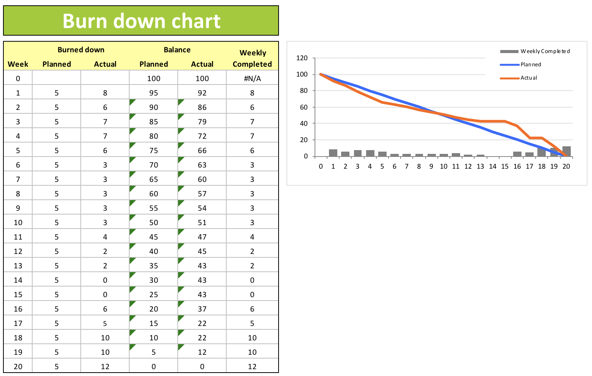

# RoloBox
RoloBox is my capstone project during my study in [UWL](https://www.uwlax.edu/), it has been moved offline after I completed my project presentation.

- [rolobox-angular](https://github.com/greenlihui/rolobox-angular)
- [rolobox-node](https://github.com/greenlihui/rolobox-node)
- [rolobox-flutter](https://github.com/greenlihui/rolobox-flutter)

## intro
RoloBox is an application that allows users to manage a list of contacts while supporting a photo-based matching feature so that users can upload images of their contacts and, more importantly, identify those contacts at a later time by taking a photo of a room or gathering with their phone. Once a person is labeled with contact information in a photo, they will later be recognized and automatically labeled when appearing in another photo.

## functionalities
- log in, log out, and manage my contact list.
- store images of groups and individuals in such a way that they can be easily accessible while remaining secure.
- associate portrait images with contact information.
- take a picture of a group or individual and have all individuals automatically recognized or labeled as not being in my contact list.
- filter my contacts by gender, age range or distinguishing face features.
- see all photos related to a certain contact.
- edit my own contact information.
- other users as friends.
- messages to my friends directly in the app.

## design and planing
### app architecture

### er diagram

### software engineering practice

### user interface
see [rolobox-angular](https://github.com/greenlihui/rolobox-angular) and [rolobox-flutter](https://github.com/greenlihui/rolobox-flutter) for UI design

## implementation
### RESTful API
**Layered Resources**

| Resources | Layer Path                                                   |
| --------- | ------------------------------------------------------------ |
| User      | /users/{userId}                                              |
| Image     | /users/{userId}/images/{imageId}                             |
| Group     | /users/{userId}/groups/{groupId}                             |
| Contact   | /users/{userId}/groups/{groupId}/contacts/{contactId}        |
| Face      | /users/{userId}/groups/{groupId}/contacts/{contactId}/faces/{faceId} |
| Friend    | /users/{userId}/friends/{friendId}                           |
| Message   | /users/{userId}/friends/{friendId}/messages/{messageId}      |

HTTP Methods
- GET for retrieve
- PUT for update
- POST for create
- DELETE for delete

### used technology
**AWS**
- S3 for image storage
- Rekognition for face indexing, detection and recognition

**Google**
- Firebase ML kit for real time face detection in mobile application

**[sharp](https://sharp.pixelplumbing.com/install)**
- Image cropping, rotation and compression.

**Security Consideration**
- Authorization and authentication support
- Session management
- XSS and CSRF protection

### programming style
- ### [mongoose programming style guide](https://github.com/Zwimber/mongoose-style-guide#folder-structure)

