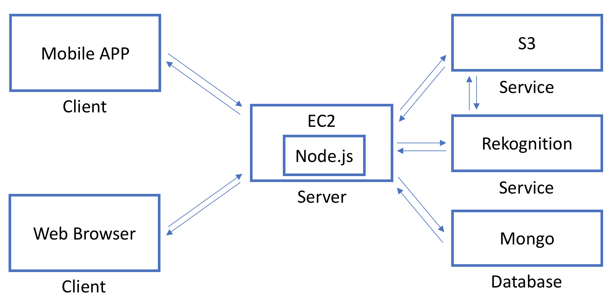
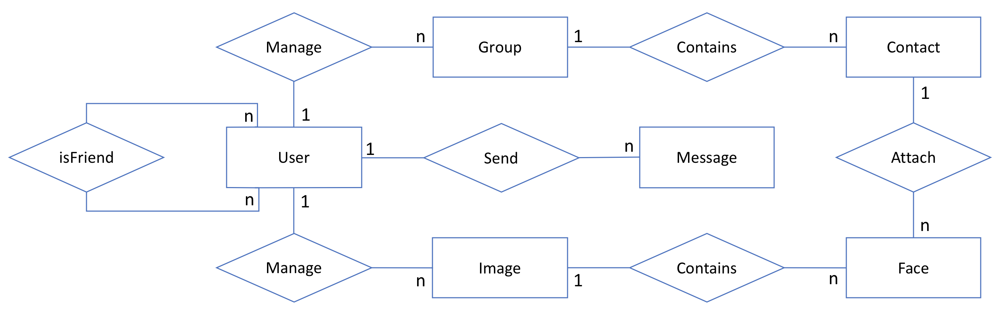

# RoloBox
- [rolobox-angular](https://github.com/greenlihui/rolobox-angular)
- [rolobox-node](https://github.com/greenlihui/rolobox-node)
- [rolobox-flutter](https://github.com/greenlihui/rolobox-flutter)

## intro
RoloBox is an application that allows users to manage a list of contacts while supporting a photo-based matching feature so that users can upload images of their contacts and, more importantly, identify those contacts at a later time by taking a photo of a room or gathering with their phone. Once a person is labeled with contact information in a photo, they will later be recognized and automatically labeled when appearing in another photo.

## functionalities
- log in, log out, and manage my contact list.
- store images of groups and individuals in such a way that they can be easily accessible while remaining secure.
- associate portrait images with contact information.
- take a picture of a group or individual and have all individuals automatically recognized or labeled as not being in my contact list.
- filter my contacts by gender, age range or distinguishing face features.
- see all photos related to a certain contact.
- edit my own contact information.
- other users as friends.
- messages to my friends directly in the app.

## app architecture

## er diagram

## implementation
## aws

## security

## programming style
### [mongoose programming style guide](https://github.com/Zwimber/mongoose-style-guide#folder-structure)
### RESTful API

